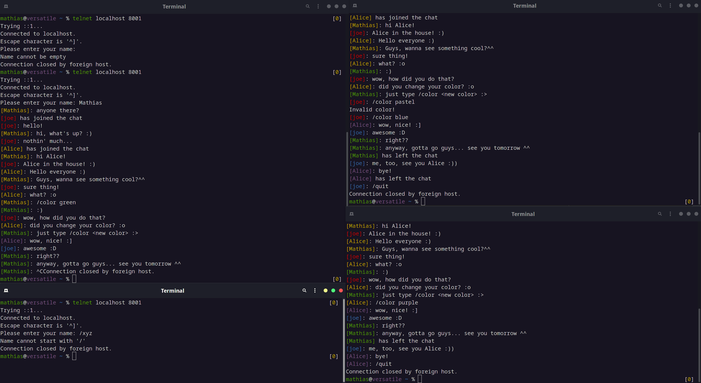

## telnet-chat

A fully asynchronous telnet chat server written in Rust.    
By using [tokio](https://docs.rs/tokio) it is especially robust, fast, non-blocking and thread-count-saving (green-thread).    
Created as project/exercise for the "*The Rust Programming Language*" course at JKU Linz.

### Features

- connect via telnet
- choose a custom username
- broadcast messages to other connected clients
- get notified when somebody new logs in or disconnects
- exit with `/quit`
- different (random) color for each new user
- change color via the `/color <red/green/blue/yellow/cyan/purple>` command

### Screenshot

